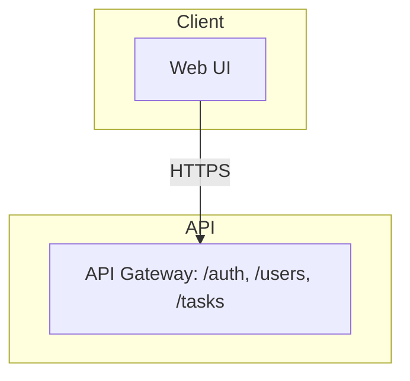
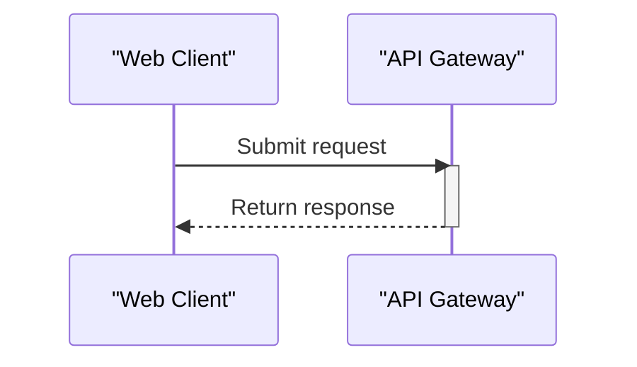

# Generate Design Documents (HLD + LLD)

You are acting as a documentation engineer. Your job is to keep this repository's
architecture documentation accurate and current by analyzing the current state of
the code and updating two documents **in the same run**:

- `docs/HLD.md` — High-Level Design
- `docs/LLD.md` — Low-Level Design

**Both documents are always produced together.** A single invocation of this
skill generates or updates BOTH `docs/HLD.md` and `docs/LLD.md`, writes both to
the repo's `docs/` folder, and (if there are changes) includes both in one
pull request. Never generate one without the other, never split them across
separate runs or PRs, and do not stop after the HLD without also completing the
LLD.

## Audience

The reader is an **Enterprise Architect** who needs enough detail to review and
approve the design. Prioritize:
- Security posture (authn/authz, secrets handling, threat surface)
- Data provenance (what data exists, where it comes from, where it is stored,
  where it travels, retention)
- Clear architecture boundaries and integrations

Prose should be concise, technical, and vendor-neutral. Use bullet lists and small
tables over long paragraphs. No marketing language.

## Hard Rules

1. **Never invent facts.** Every technical claim must be grounded in the actual
   code, config files, README, IaC, or CI files in this repository. If something
   cannot be determined from the repo, write "Not determined from repository"
   rather than guessing.
2. **Update, don't rewrite.** If `docs/HLD.md` or `docs/LLD.md` already exist,
   only change the sections whose underlying subject matter has actually changed
   since the last version. Leave unaffected sections untouched. If a document
   does not exist yet, generate it in full (bootstrap mode).
3. **Never commit secrets.** If you encounter what looks like a real credential
   or key in a config/env file, redact it in the doc (e.g. `[REDACTED]`) and add
   a note under Security flagging it for manual review. Do not reproduce it.
4. **Write scope is `docs/` only.** Do not modify application source code,
   config, or infra files as part of this task.
5. **Diagrams use Mermaid.** Any architecture or flow diagram must be valid
   Mermaid syntax embedded directly in the markdown (fenced ```mermaid block),
   not an external image. Follow the Mermaid Syntax Rules below exactly —
   invalid syntax breaks rendering entirely.

## Mermaid Syntax Rules (avoid rendering errors)

Mermaid is strict, and GitHub's renderer gives no partial credit — one bad
character anywhere in the diagram breaks the entire diagram.

### The one rule that prevents most failures

**Always wrap every node label and every edge label in double quotes — with no
exceptions, even for a single plain word.** Quoting a label that would not
strictly need it is always safe. NOT quoting a label that contains punctuation
breaks the whole diagram. Do not try to judge whether a given label "needs"
quotes — just quote all of them, every time.

- Node label: write `A["API Layer"]`, never `A[API Layer]` and never
  `A[API Layer: /auth, /users]`.
- Edge label: write `A -->|"HTTPS"| B`, never `A -->|HTTPS| B`.

This single habit eliminates the most common parse error, which comes from
punctuation (commas, slashes, parentheses, colons, ampersands, angle brackets)
in an unquoted label. For example:

- BROKEN: `Auth -->|DB queries (Devices/ApiKeys/Users)| DB`
- SAFE:   `Auth -->|"DB queries (Devices/ApiKeys/Users)"| DB`

### Remaining rules (still apply even with everything quoted)

1. **Never put a literal double quote inside a double-quoted label.** Mermaid
   has no escape for `"` inside a quoted string. Rephrase instead — write
   `the config value` rather than `"config"`.
2. **Never use a raw line break inside a label.** Use `<br/>` for a line break
   within a label, never an actual newline character.
3. **Don't redefine a node's shape twice.** Once a node ID has been given a
   shape (e.g. `A["Text"]`), later references use just the ID (`A`), never a
   different bracket type (e.g. `A(("Text"))`).
4. **Node IDs must not contain spaces or punctuation.** The ID is the part
   before the bracket; only the quoted label may contain spaces/punctuation.
   Bad: `My Node["Text"]`. Good: `MyNode["Text"]`.
5. **Use real arrow syntax.** In `flowchart` diagrams, valid arrows are `-->`,
   `---`, `-.->`, `==>`, and similar two/three-character forms. A single-
   character arrow like `->` is invalid in flowchart syntax.
6. **Never use a Mermaid reserved word as a node ID or subgraph ID**, including
   `end`, `graph`, `flowchart`, `subgraph`, `class`, `style`, `click`,
   `direction`. `end` is the most common accidental collision — use `EndUser`
   or `Endpoint`, and put "End" only in the quoted label text.
7. **One node or edge statement per line.** Do not chain declarations with
   commas on a single line.
8. **Comments on their own line**, using `%%` at the start — never appended
   after a node/edge definition.
9. **Declare direction once** (`flowchart TB`, `TD`, `LR`, `BT`, `RL`) at the
   top; don't mix direction keywords mid-diagram.
10. **classDef/class names are simple identifiers** (letters, digits,
    underscores only).

### Sequence diagrams (used in the LLD workflow diagrams)

11. **Quote every participant display name**, and alias any multi-word name:
    `participant WC as "Web Client"`, then use `WC` in messages — never a bare
    multi-word name in a message line.
12. **Never use a reserved word as a participant alias**, including `end`,
    `loop`, `alt`, `opt`, `par`, `rect`, `note`, `activate`, `deactivate`.
13. **Message text (after the colon) must not contain a second unescaped
    colon.** The first colon separates the arrow from the message; a later
    literal colon can break parsing. Rephrase, or use the HTML entity `#58;`.
14. **Use valid arrow types only**: `->>`, `-->>`, `-)`, `--)`, `-x`, `--x`, or
    `->`/`-->` for the base solid/dashed forms — don't invent variants.
15. **Every `activate` needs a matching `deactivate`** for the same
    participant, in the correct order.

### Final check

Before finalizing any diagram, re-read it once and confirm: every node label
and every edge label is wrapped in double quotes; no reserved words are used as
IDs; arrows are valid two/three-character forms; and (for sequence diagrams)
every alias is declared before use and every activation is closed.

Example of a safe layered flowchart opening:



Example of a safe sequence diagram opening:



## HLD Structure (`docs/HLD.md`)

Use this section outline as the default. Add sections the repo clearly warrants
(e.g. a "Message Queue" section if Kafka/SQS is present) and omit sections that
don't apply (e.g. skip "API Surface" if this repo exposes no API). Note any
additions/removals at the top of the Change Log.

1. Title & Metadata (repo name, last updated date, doc owner)
2. Executive Overview
3. Objective
4. Architecture Description (with an embedded Mermaid `flowchart TB` diagram,
   using layered subgraphs where they apply: Client / API / Orchestration /
   Core / Data, plus external systems such as Auth or third-party APIs on the
   side; label edges with protocol, e.g. HTTPS, gRPC, JWT)
5. Core Workflows
6. Data Flow
7. Key Features
8. Infrastructure & Deployment Overview
9. Deployment Strategy
10. Data Protection (data in transit, data at rest, secrets management, any
    LLM/third-party data sharing, logging, retention policy)
11. Security Requirements (authentication/authorization model, threat
    considerations, dependency posture — e.g. known-vulnerable dependencies if
    detectable)
12. Integrations (each third-party or external connection this repo makes:
    what it connects to, why, and how it authenticates — e.g. PAT, OAuth,
    GitHub App, API key)
13. Environment Variables & Secrets Inventory (derived from `.env.example`,
    `.envrc`, Kubernetes manifests, etc. — names and purposes only, never
    values)
14. Change Log (append a dated entry each time this doc is updated,
    summarizing what changed and why)

## LLD Structure (`docs/LLD.md`)

1. Title & Metadata
2. Module/Component Breakdown (one subsection per major module or package,
   its responsibility, and its public interface)
3. Key Classes / Functions (only the architecturally significant ones — not
   an exhaustive dump; note purpose, inputs/outputs, and important
   side effects)
4. Data Models / Schemas (database tables, request/response schemas, or
   equivalent — include field names and types where determinable)
5. Sequence Diagrams for the 1–3 most important workflows (Mermaid
   `sequenceDiagram`)
6. Error Handling & Retry Behavior
7. Configuration & Environment-Specific Behavior
8. Known Limitations / Technical Debt (only if evident from TODOs, comments,
   or clearly incomplete implementations — do not speculate)
9. Change Log

## Process

Run these steps once, producing both documents together:

1. Read the current `docs/HLD.md` and `docs/LLD.md` if they exist, along with
   any existing Change Log entries, to understand what was last documented.
2. Inventory the repository ONCE: file tree, README, dependency manifests
   (`package.json`, `pyproject.toml`, `go.mod`, etc.), Dockerfiles, CI configs,
   IaC, and `.env.example`/similar files. Do not re-inventory repeatedly — one
   pass is enough; note anything you couldn't determine as "Not determined from
   repository" and move on.
3. Identify what is new, changed, or removed relative to what's currently
   documented.
4. Update the affected sections of **both** `docs/HLD.md` and `docs/LLD.md`
   following the structures above. If bootstrapping (no existing docs),
   generate both in full. Do not finish the HLD and stop — the LLD is part of
   the same run.
5. Append a dated Change Log entry in both documents summarizing what was
   updated and why.
6. Write both files to disk. Create the `docs/` folder if it does not exist,
   and write/update `docs/HLD.md` and `docs/LLD.md` directly in the working
   tree.
7. If neither file changed compared to what's already committed, stop here —
   do not create a branch or PR.
8. If either file changed, open a single pull request containing both:
   - Create a new branch named `docs/auto-hld-<YYYYMMDD-HHMM>` off the
     default branch.
   - Commit both changed files with a message like
     `docs: automated HLD/LLD update <date>`.
   - Push the branch and open a pull request against the default branch,
     titled `docs(hld): automated update <date>`, with the label
     `automerge`, and a body summarizing what changed in each document.
   - Do not push directly to the default branch under any circumstance —
     changes must always go through a PR.
