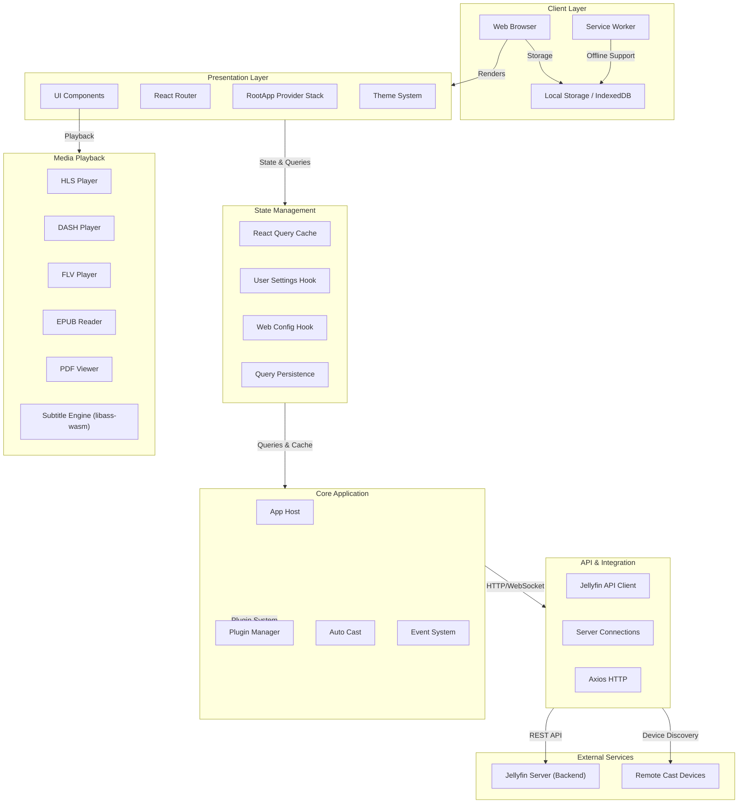

# Jellyfin Web - High-Level Design (HLD)

**Repository:** NikithaJoshy/jellyfin-web (fork of jellyfin/jellyfin-web)  
**Version:** 13.0.0  
**Last Updated:** September 11, 2026  
**Language Composition:** JavaScript (43.9%), TypeScript (29.4%), SCSS (22.4%), HTML (4.2%), Python (0.1%), Nix (0%)  
**License:** GPL-2.0-or-later

---

## Executive Overview

Jellyfin Web is the official web client for the Jellyfin media system—a free, open-source media server. This component provides a rich, browser-based user interface that enables users to discover, stream, and manage media across desktop browsers, mobile devices (Android, iOS), and smart TV platforms. The application is built with modern web technologies including React 18, TypeScript, Material-UI, and Webpack, delivering a responsive and accessible interface across a wide range of devices and browsers.

---

## Objective

The jellyfin-web component serves as the **primary client interface** for the Jellyfin media system, enabling:

- **User Authentication & Session Management:** Secure sign-in, multi-server support, and session state persistence
- **Media Discovery & Browsing:** Navigate library hierarchy, search functionality, metadata display
- **Media Playback:** Stream audio, video (HLS, DASH, progressive), subtitles, and specialized formats (eBooks, comics, PDFs)
- **Playback Control:** Remote casting (Chromecast), device selection, playback device coordination
- **User Preferences:** Theme selection, language configuration, settings persistence
- **Plugin Architecture:** Extensibility through a plugin system supporting additional players and features
- **Cross-Platform Compatibility:** Support for legacy browsers (ES5 transpilation), modern browsers, iOS, Android, and TVs

---

## Architecture Description



### Layer Breakdown

#### 1. **Client Layer**
- **Web Browser:** Target environment with support for modern and legacy browsers
- **Service Worker:** Enables offline functionality, caching, and background synchronization
- **Local Storage/IndexedDB:** Persists user preferences, server connections, and cached query data

#### 2. **Presentation Layer**
- **React Router:** Client-side navigation between views (home, library, playback, settings)
- **UI Components:** Modular React components built with Material-UI (MUI) and custom styling
- **Theme System:** Multiple pre-defined themes (Dark, Light, Blue Radiance, Purple Haze, Apple TV, WMC); theme CSS compiled separately via Webpack

#### 3. **State Management**
- **React Query (TanStack Query):** Manages server data fetching, caching, and synchronization
- **React Query Persist Client:** Persists query cache to IndexedDB for offline access
- **User Settings Hook:** Manages user-level preferences
- **Web Config Hook:** Manages application-wide configuration

#### 4. **Core Application**
- **App Host:** Detects app mode (web, Cordova, Android), initializes platform-specific features
- **Plugin Manager:** Dynamic loading and management of extension plugins
- **Auto Cast:** Automatic device detection and default remote playback target selection
- **Event System:** Global event emitter for cross-module communication

#### 5. **API & Integration**
- **Jellyfin API Client:** TypeScript/JavaScript wrapper around Jellyfin REST API
- **Server Connections:** Manages multiple server connections and API client lifecycle
- **Axios HTTP:** Low-level HTTP transport with request/response interceptors

#### 6. **Media Playback**
- **HLS/DASH Players:** Video streaming via hls.js and DASH.js
- **Progressive Download:** Direct streaming for MPEG-4, MKV, etc.
- **Subtitle Engine:** libass-wasm for advanced subtitle rendering (ASS/SSA formats)
- **Specialized Readers:** EPUB (eBooks), PDF, Comic reader plugins

#### 7. **External Integration**
- **Jellyfin Server:** Backend media server providing REST API, metadata, and transcoding services
- **Remote Cast Devices:** Chromecast and other remote playback targets

---

## Core Workflows

### 1. Application Initialization

```
index.jsx → RootApp.tsx → RootAppRouter.tsx → AppRouter
    ↓
    • Load browser polyfills (legacy support)
    • Initialize ServerConnections (API client lifecycle)
    • Load core translation dictionary (i18n)
    • Initialize AppHost (detect platform, load features)
    • Load installed plugins (dynamically)
    • Register service worker
    • Mount React root and render UI
```

### 2. User Authentication & Server Connection

```
1. Check for last-used server (localStorage)
2. If found → initialize API client with server URL
3. If not found → prompt server discovery (server address detection)
4. User enters credentials → ServerConnections.authenticate()
5. On success → store server connection, user session
6. Emit "localusersignedin" event → global listeners update culture, permissions
7. Fetch user-specific settings, library metadata
```

### 3. Media Playback

```
1. User navigates to item detail page
2. AppRouter → item resolver fetches metadata (React Query)
3. User clicks play → determine playback device
4. Evaluate plugin order: htmlVideoPlayer → htmlAudioPlayer → specialized players
5. Init player: create playback session, get streaming URL
6. If remote device: send cast intent → remote device handles playback
7. If local: spawn video/audio element, attach playback control listeners
8. On completion: update resume position, cleanup session
```

### 4. Plugin Loading

```
1. Read plugin list from config.json
2. For each plugin:
   - Fetch plugin manifest (plugin.json)
   - Load plugin entry point (async import)
   - Call plugin.install() if present
   - Register with PluginManager
3. Handle errors gracefully; continue if a plugin fails
4. Emit "pluginsloaded" event
```

---

## Data Flow

### Request Flow

```
User Action (e.g., click "Play")
    ↓
React Component (event handler)
    ↓
useApi Hook or React Query mutation
    ↓
Axios HTTP Client (Jellyfin API)
    ↓
Jellyfin Server (REST endpoint)
    ↓
Response (JSON)
    ↓
React Query Cache (update state)
    ↓
Component Re-render
```

### State Persistence

```
Component State / User Preferences
    ↓
React Query Cache
    ↓
QueryClientProvider persister (before unmount)
    ↓
IndexedDB (via react-query-persist-client)
    ↓
On App Restart: IndexedDB → React Query Cache → UI
```

### Real-time Updates

```
Jellyfin Server Notifications (WebSocket)
    ↓
initializeServerConnections() listener
    ↓
Event emitter (global Events object)
    ↓
Subscribed components / hooks
    ↓
Query invalidation → refetch
    ↓
UI update
```

---

## Key Features

| Feature | Implementation | Notes |
|---------|---|---|
| **Multi-Server Support** | ServerConnections manager; user can switch between multiple Jellyfin servers | Requires explicit server management UI |
| **Responsive UI** | React + Material-UI + custom SCSS; mobile-first CSS; viewport meta tags | Browser-based and native containers (Cordova, Android) |
| **Offline Playback** | Service Worker + React Query persistence to IndexedDB | Cached data available offline |
| **Multiple Themes** | 6 pre-built themes; compiled as separate CSS bundles; theme selector UI | Theme CSS lazy-loaded on selection |
| **Plugin Architecture** | Dynamic import system; plugins can register players, features, components | Extensible for third-party developers |
| **Subtitles** | libass-wasm; supports ASS/SSA, VTT, SRT via plugins | Advanced rendering for complex subtitle formats |
| **Casting** | Chromecast integration; session player plugin; device auto-detection | Falls back to local playback if casting unavailable |
| **Accessibility** | Keyboard navigation, auto-focuser, screen reader support via semantic HTML | ARIA labels applied to critical UI elements |
| **i18n / Localization** | Globalize-based translation system; supports 50+ languages | Translations managed via Weblate; fetched at runtime |

---

## Infrastructure & Deployment Overview

### Build System

- **Webpack 5:** Module bundler; splits bundles by theme, vendor, app code
- **Babel:** ES5 transpilation for legacy browser support (Chrome 27, Firefox ESR, IE11 polyfills)
- **TypeScript:** Type-safe development; compiled to JavaScript
- **PostCSS + Sass:** CSS preprocessing and autoprefixing

### Development

- **webpack-dev-server:** Hot module replacement; development server on `http://localhost:8080`
- **Vitest + jsdom:** Unit testing framework; coverage reporting

### Dependency Management

- **Node.js >= 24.0.0**
- **npm >= 11.0.0**
- **Core dependencies:** React 18, React Router 6, Material-UI v6, TanStack React Query v5, Axios
- **Media libraries:** hls.js, flv.js, epubjs, pdfjs-dist, libass-wasm

### Distribution

- **Output:** `dist/` directory containing:
  - `main.jellyfin.bundle.js` (main app bundle)
  - `serviceworker.js` (service worker entry)
  - `themes/[theme-name]/theme.css` (theme CSS)
  - `config.json` (application configuration)
  - `assets/` (favicons, static files)
  - Vendor bundles split by package (code splitting)

---

## Deployment Strategy

### Browser Clients

1. **Hosted Static Files:** Jellyfin server hosts the built web client
2. **Embedded UI:** Docker image packages the built client with Jellyfin server
3. **Standalone:** Web client can be deployed independently and connected to remote Jellyfin server

### Native Wrappers

- **Cordova:** Wraps web client for Android/iOS app stores
- **NativeShell:** Custom native wrapper for TV and desktop apps
- **Web-based:** Progressive Web App (PWA) with service worker support

### Version Management

- **Semantic Versioning:** Current version 13.0.0
- **Build Metadata:** Includes commit SHA and build timestamp in logs
- **Cache Busting:** Webpack content hashing on production builds; query client cache busted by `__JF_BUILD_VERSION__`

---

## Data Protection

### Data in Transit

- **HTTPS:** All communication with Jellyfin server over HTTPS in production
- **API Authentication:** Bearer token (JWT or custom) in Authorization header
- **WebSocket:** Secure WebSocket (WSS) for server notifications

### Data at Rest

- **Client-Side Storage:**
  - **localStorage:** Server connections, user preferences, theme selection
  - **IndexedDB:** React Query cache, large datasets for offline access
  - **Session Storage:** Temporary data during active session
- **No Sensitive Data Cached:** Passwords are NOT persisted; only auth tokens stored
- **Token Lifecycle:** Tokens cleared on logout; IndexedDB cache cleared on session end

### Secrets Management

- **No Hardcoded Secrets:** All secrets (API keys, server URLs) are configuration-driven
- **Server URL Discovery:** User provides server URL or app auto-detects via mDNS/UPnP (platform-dependent)
- **API Token Storage:** Auth tokens stored in localStorage (not ideal for high-security scenarios); CSRF protection via SameSite cookies (server-side)

### Logging & Retention

- **Console Logging:** Build metadata, plugin load status, errors logged to browser console
- **Retention:** Browser console logs are ephemeral (cleared on session end or manual clear)
- **No Remote Logging:** Application does NOT send logs to external service by default
- **Opt-in Telemetry:** User can enable diagnostic data sharing (feature detection, error reporting)

### Third-Party Data Sharing

- **Translation Services:** Weblate hosts translation strings (community-driven; no user data)
- **Analytics:** Not built-in; deployments may add third-party analytics (optional)
- **CDN:** Static assets can be served via CDN (configuration-dependent)

---

## Security Requirements

### Authentication & Authorization

| Requirement | Implementation |
|---|---|
| **Server Authentication** | Jellyfin API token (Bearer JWT or equivalent) |
| **Multi-User Support** | User sessions isolated per auth token |
| **Permission Model** | Jellyfin server enforces library/feature permissions; client respects headers/403 responses |
| **Session Timeout** | Server-managed; client handles 401 responses by redirecting to login |
| **Multi-Server Auth** | Each server connection maintains separate auth token; user manually switches servers |

### Threat Considerations

| Threat | Mitigation |
|---|---|
| **XSS (Cross-Site Scripting)** | React's JSX escaping; DOMPurify for user-generated content; Content Security Policy (CSP) headers from server |
| **CSRF (Cross-Site Request Forgery)** | SameSite cookie flags (server-side); no cross-origin fetch credentials by default |
| **Token Exposure** | Auth token stored in localStorage; vulnerable to XSS but mitigated by framework defaults |
| **Plugin Injection** | Plugins loaded from config.json; no sandbox; trust model assumes plugins are vetted by deployment |
| **Man-in-the-Middle** | HTTPS/TLS required for production; certificate validation by browser |
| **Dependency Vulnerabilities** | Dependencies tracked; security patches applied via npm updates; ESLint SonarJS plugin checks for common issues |

### Dependency Posture

- **Current Dependencies:** 60+ production dependencies; 50+ dev dependencies
- **Audit:** Run `npm audit` regularly; known vulnerabilities addressed in release cycles
- **Outdated Packages:** Maintained by Jellyfin team; updates aligned with feature releases
- **Notable Vulnerabilities:** None documented in current snapshot; monitor GitHub Security Advisories

---

## Integrations

### Jellyfin Server (Primary Integration)

| Aspect | Details |
|---|---|
| **What** | Jellyfin media server backend |
| **Why** | Source of media metadata, stream URLs, user data, authentication |
| **How** | REST API (HTTP/HTTPS) + WebSocket for real-time updates |
| **Authentication** | Bearer token (JWT) in Authorization header |
| **Failure Mode** | Graceful degradation; offline cache used if available; user prompted to reconnect |

### Media Streaming Endpoints

| Type | Protocol | Players |
|---|---|---|
| **HLS** | HTTP/HTTPS | hls.js (HTML5 video) |
| **DASH** | HTTP/HTTPS | dash.js (HTML5 video) |
| **Progressive** | HTTP/HTTPS | HTML5 `<video>` / `<audio>` elements |
| **FLV** | HTTP/HTTPS | flv.js |

### Remote Playback Devices

| Device | Protocol | Player Plugin |
|---|---|---|
| **Chromecast** | Cast Protocol (mDNS/gRPC) | chromecastPlayer |
| **Session Player** | Jellyfin API (device session) | sessionPlayer |
| **DLNA/UPnP** | Not determined from repository |

### Translation Service

- **Weblate:** Community crowdsourced translations
- **How:** Developers extract strings from code → Weblate hosts → community translates → translations pulled into repo
- **No User Data Shared:** Translation service does not receive user browsing data

### Browser APIs & Native Integrations

| API | Purpose | Usage |
|---|---|---|
| **Service Worker** | Offline support, caching | Registered for non-TV/non-console clients |
| **IndexedDB** | Query persistence, offline data | React Query cache persisted here |
| **localStorage** | User preferences, server connections | Small configuration data |
| **Web Notifications** | Push notifications | Opt-in; requires user permission |
| **Fullscreen API** | Video playback fullscreen | Player plugins utilize this |
| **Media Session API** | Media control integration | Not determined from repository |

---

## Environment Variables & Secrets Inventory

### Build-Time Variables (webpack.DefinePlugin)

| Variable | Purpose | Default | Notes |
|---|---|---|---|
| `__COMMIT_SHA__` | Git commit hash for versioning | Auto-detected from `git describe --always` | Empty if git unavailable |
| `__JF_BUILD_VERSION__` | Build/release version | `JELLYFIN_VERSION` env var or "Release" | "Dev Server" if webpack-serve active |
| `__PACKAGE_JSON_VERSION__` | Package version from package.json | "13.0.0" | Auto-populated |
| `__PACKAGE_JSON_NAME__` | Package name | "jellyfin-web" | Auto-populated |
| `__USE_SYSTEM_FONTS__` | Font loading strategy | false | Set via `USE_SYSTEM_FONTS` env var |
| `__WEBPACK_SERVE__` | Dev server mode flag | false | Auto-populated |

### Runtime Configuration (config.json)

| Setting | Purpose | Example Value |
|---|---|---|
| `includeCorsCredentials` | Cross-origin credentials in API calls | false |
| `multiserver` | Enable multi-server UI | false |
| `themes` | Available theme definitions | Array of theme objects |
| `plugins` | Plugins to auto-load | Array of plugin module paths |
| `menuLinks` | Custom menu links | Empty array (extensible) |
| `servers` | Pre-configured server URLs | Empty array (user-provided) |

### Environment Variables (Runtime)

| Variable | Purpose | Required | Notes |
|---|---|---|---|
| `NODE_ENV` | Build mode (development/production) | Yes for build | Affects optimization, minification |
| `JELLYFIN_VERSION` | Release version | No | Overrides default "Release" |

### Secrets (Not in Code)

| Secret | Storage | Scope | Notes |
|---|---|---|---|
| **Jellyfin API Token** | localStorage (client session) | User auth | Obtained via login flow; cleared on logout |
| **Server URL** | localStorage (persistent) | Multi-server | User-provided; no hardcoding |

---

## Change Log

### Version 1.0 (September 11, 2026)

**Changes:**
- Initial HLD documentation created
- Documented architecture layers: Client, Presentation, State, Core, API, Media, External
- Documented core workflows: initialization, authentication, playback, plugin loading
- Documented data flow: request flow, state persistence, real-time updates
- Documented key features: multi-server, responsive UI, offline support, themes, plugins, casting, accessibility, i18n
- Documented infrastructure: Webpack build system, Babel transpilation, TypeScript, Sass/PostCSS
- Documented deployment: browser clients, native wrappers, version management
- Documented data protection: transit, storage, secrets, logging, third-party sharing
- Documented security: authentication, authorization, threat mitigations, dependency posture
- Documented integrations: Jellyfin server, media streaming, remote playback, translations, browser APIs
- Documented environment variables and secrets inventory
- **Next Steps:** Monitor dependency updates, security advisories, and update HLD as major architectural changes occur (e.g., state management refactor, new player backends)
