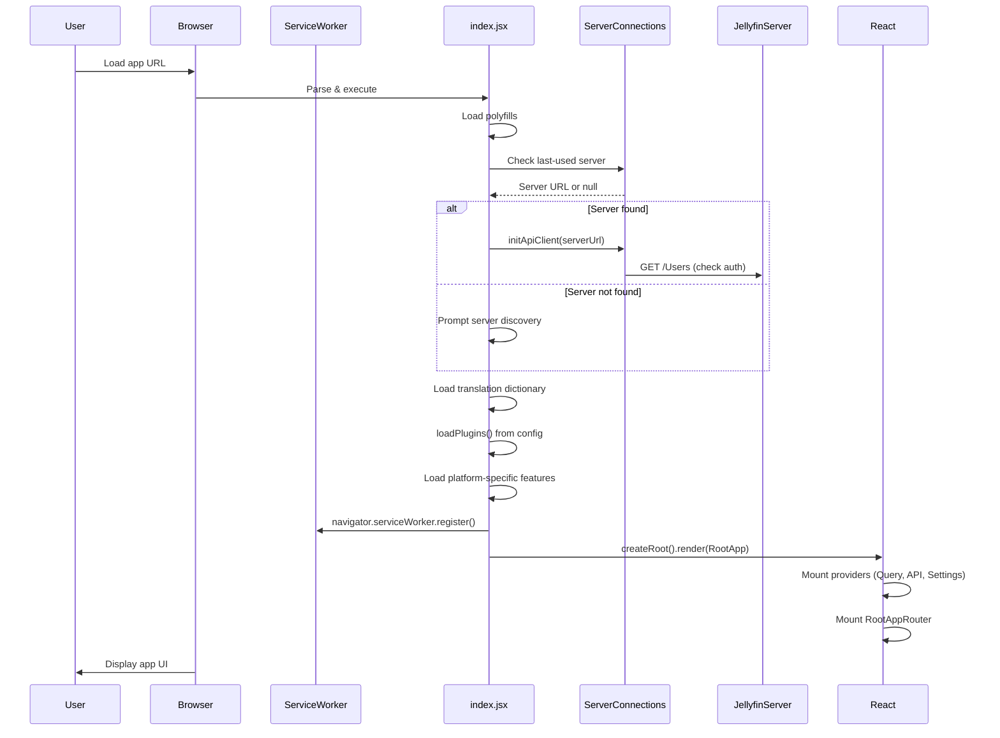
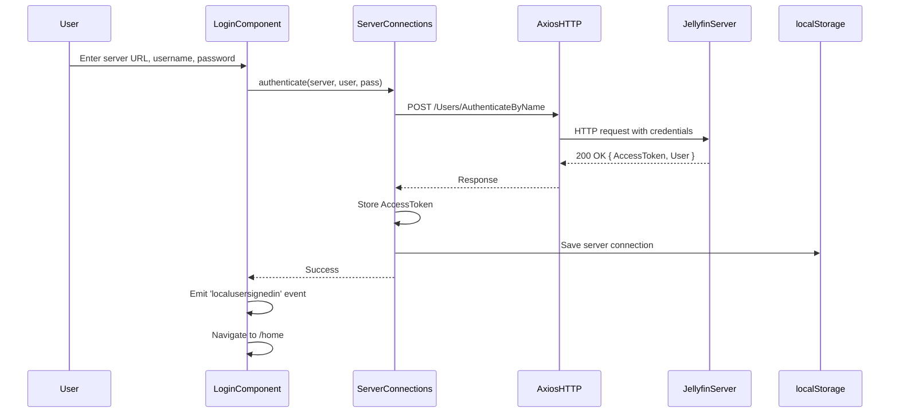
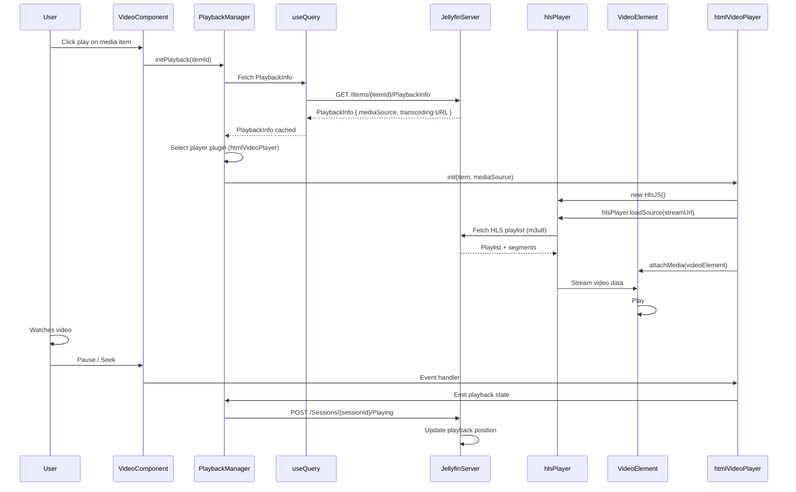
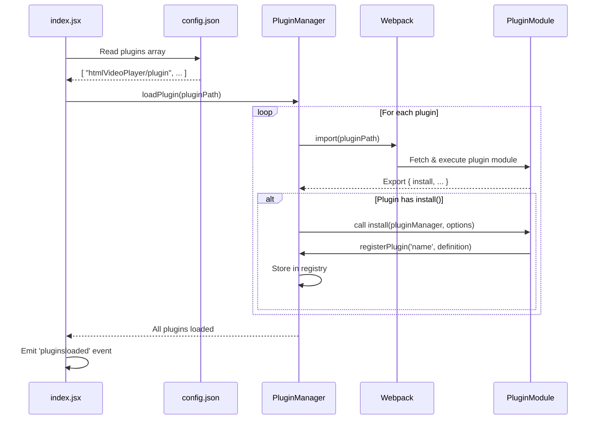

# Jellyfin Web - Low-Level Design (LLD)

**Repository:** NikithaJoshy/jellyfin-web  
**Version:** 13.0.0  
**Last Updated:** September 11, 2026  

---

## Module/Component Breakdown

### 1. **Entry Point & Initialization (`src/index.jsx`)**

**Responsibility:** Bootstrap the application, initialize core services, and mount the React root.

**Public Interface:**
- `init()` — Async function orchestrating all initialization steps
- Exported implicitly; called on module load

**Key Steps:**
1. Load browser polyfills (`lib/legacy`)
2. Initialize `ServerConnections` (API client lifecycle)
3. Detect and set last-used server URL
4. Initialize API client if server found
5. Load translation dictionary (`globalize`)
6. Load platform-specific fonts (system fonts vs. web fonts)
7. Load plugins from config (`loadPlugins()`)
8. Register service worker for offline support
9. Render React root with `RootApp` component
10. Enable keyboard navigation and auto-focus

**Important Side Effects:**
- Registers global objects: `window.Events`, `window.TaskButton`
- Dynamically imports platform-specific features based on device type (TV, Xbox, PS4, mobile)
- Registers API error handlers on all clients and newly created clients

**Error Handling:**
- Plugin load failures logged but don't block initialization
- Service worker registration failures logged as warnings
- Graceful degradation if server URL cannot be determined

---

### 2. **Root Application Component (`src/RootApp.tsx`)**

**Responsibility:** Provide global context providers for state management, API access, and configuration.

**Public Interface:**
```typescript
const RootApp = () => (
    <PersistQueryClientProvider> ... </PersistQueryClientProvider>
);
export default RootApp;
```

**Provider Stack (Nesting Order):**
1. **PersistQueryClientProvider** — React Query with cache persistence to IndexedDB
   - Client: `queryClient` (configured in `utils/query/queryClient`)
   - Persister: `idb-keyval` backend
   - Cache buster: `__JF_BUILD_VERSION__` (invalidates cache on new build)
2. **ApiProvider** — Exposes Jellyfin API client via `useApi()` hook
3. **UserSettingsProvider** — User preferences (theme, language, volume, etc.)
4. **WebConfigProvider** — Application-wide config from `config.json`
5. **QueryClientEventHandler** — Subscribes to React Query events (network status, mutations)
6. **RootAppRouter** — Router component managing view navigation

**Conditional Rendering:**
- React Query DevTools mounted only if browser supports `Proxy` and is not a TV device

---

### 3. **Routing & Navigation (`src/RootAppRouter.tsx`, `src/components/router/appRouter`)**

**Responsibility:** Manage SPA routing, view transitions, and navigation guards.

**Public Interface:**
```typescript
export const appRouter = {
    onRequestFail: (event, error) => { /* 401/403 handler */ },
    navigate: (path, replace?) => { /* navigation */ }
};
```

**Key Routes (Inferred from Config & Plugins):**
- `/home` — Dashboard / home page
- `/details/:id` — Media item details
- `/playback` — Playback page (video/audio player)
- `/library` — Library browser
- `/settings` — User settings
- `/login` — Authentication page

**Error Handling:**
- `onRequestFail` handler catches API errors:
  - **401 Unauthorized** → redirect to login
  - **403 Forbidden** → show permission denied message
  - **5xx Errors** → show server error, retry option
- Debounced error display (prevents spam)

---

### 4. **API Client Integration (`src/lib/jellyfin-apiclient`, `src/hooks/useApi.ts`)**

**Responsibility:** Provide typed, context-based access to Jellyfin API.

**Public Interface:**
```typescript
const api = useApi();
const response = await api.get('/Users/{userId}/Items');
const mediaList = await api.getJSON('/Items?...query params...');
```

**Key Methods:**
- `api.get(endpoint, config?)` — GET request
- `api.post(endpoint, data, config?)` — POST request
- `api.getJSON(endpoint)` — GET with JSON response
- `api.authenticateWithUsernamePassword(server, username, password)` — Login

**Authentication:**
- Bearer token injected in Authorization header
- Token obtained from `ServerConnections.getApiClient().getAuthorizationHeader()`

**Axios Interceptors:**
- Request: Attach auth token, set Content-Type
- Response: Handle 401/403, retry logic

**Error Handling:**
- Errors emitted to EventEmitter (global `Events` object)
- Consumed by router (`onRequestFail`)

---

### 5. **State Management - React Query (`src/utils/query/queryClient.ts`)**

**Responsibility:** Configure React Query client, cache settings, and persistence.

**Configuration:**
```typescript
const queryClient = new QueryClient({
    defaultOptions: {
        queries: {
            staleTime: 5 * 60 * 1000,      // 5 min
            gcTime: 10 * 60 * 1000,        // 10 min (garbage collection)
            retry: 1,
            refetchOnWindowFocus: true
        }
    }
});
```

**Persister:**
```typescript
const persister = createIDBPersister();
// Persists entire cache to IndexedDB on mutation/unmount
// Hydrates from IndexedDB on app restart
```

**Cache Invalidation:**
- Automatic: Query stale time expiration
- Manual: `queryClient.invalidateQueries({ queryKey: ['items', id] })`
- Plugin mutations: Player plugins invalidate playback state queries

**Query Keys Convention:**
- `['items']` — Media items list
- `['items', id]` — Single item details
- `['user', userId]` — User info
- `['playback', sessionId]` — Playback session state

---

### 6. **User Settings Hook (`src/hooks/useUserSettings.ts`)**

**Responsibility:** Manage user preferences (theme, language, volume, resume position, etc.).

**Public Interface:**
```typescript
const { userSettings, updateUserSetting } = useUserSettings();
// Access: userSettings.theme, userSettings.language
// Update: updateUserSetting('theme', 'dark')
```

**Storage:**
- Persisted to `localStorage` key: `jellyfin-user-settings`
- Updated on user action or server sync
- Synced to Jellyfin server (user-level display preferences)

**Key Settings:**
- `theme` — Selected theme ID
- `language` — ISO language code
- `videoPlayer` — Preferred player plugin
- `subtitlePreferences` — Font size, language selection, etc.

---

### 7. **Web Config Hook (`src/hooks/useWebConfig.ts`)**

**Responsibility:** Expose static application configuration from `src/config.json`.

**Public Interface:**
```typescript
const { webConfig } = useWebConfig();
// Access: webConfig.themes, webConfig.plugins
```

**Configuration Source:** `src/config.json`

**Contents:**
- `themes` — Array of theme definitions (name, ID, color)
- `plugins` — Array of plugin module paths to auto-load
- `multiserver` — Enable multi-server UI
- `includeCorsCredentials` — CORS credential handling
- `menuLinks` — Custom menu links (extensible)
- `servers` — Pre-configured server list (empty by default)

---

### 8. **Plugin Manager (`src/components/pluginManager.ts`)**

**Responsibility:** Dynamic loading, lifecycle management, and registration of plugins.

**Public Interface:**
```typescript
export const pluginManager = {
    loadPlugin: async (pluginPath: string) => void,
    registerPlugin: (name: string, plugin: PluginDefinition) => void,
    getPlugin: (name: string) => PluginDefinition | undefined
};
```

**Plugin Lifecycle:**
1. **Load:** Webpack dynamic import of plugin module
   ```javascript
   const plugin = await import(/* webpackChunkName: "plugin" */ `./plugins/${pluginPath}`);
   ```
2. **Validate:** Check plugin exports `default` or `install` function
3. **Install:** Call `plugin.install(pluginManager, options)` if present
4. **Register:** Store in internal registry by name

**Plugin Interface:**
```typescript
interface PluginDefinition {
    install?: (manager: PluginManager, options: any) => void;
    // Plugin-specific properties (players, features, etc.)
}
```

**Error Handling:**
- Load failures caught and logged; subsequent plugins load
- Invalid plugin structure logged; skipped gracefully

---

### 9. **App Host (`src/components/apphost.ts`)**

**Responsibility:** Detect runtime environment and initialize platform-specific features.

**Public Interface:**
```typescript
export const appHost = {
    init: async () => void,
    supports: (feature: AppFeature) => boolean,
    // Feature flags based on platform
};
```

**Platform Detection:**
- `browser.web` — Standard web browser
- `browser.cordova` — Cordova (mobile wrapper)
- `browser.android` — Android-specific
- `browser.ios` — iOS-specific
- `browser.tv` — TV device (Roku, WebOS, Tizen, etc.)
- `browser.xboxOne`, `browser.ps4` — Game consoles

**Feature Flags (AppFeature enum):**
- `RemoteControl` — Can send cast intents to other devices
- `PhysicalVolumeControl` — Has hardware volume buttons
- And others based on platform capabilities

**Initialization Tasks:**
- Load platform-specific plugins (e.g., NativeShell plugins for TV)
- Initialize native bridge (if applicable)
- Set app-specific styles (TV layout vs. desktop)

---

### 10. **Media Players (Plugin Architecture)**

**Responsibility:** Provide player implementations for different media types.

**Player Plugin Types:**

#### a. **htmlVideoPlayer** (`src/plugins/htmlVideoPlayer/plugin.js`)
- Streams video via HLS (hls.js), DASH (dash.js), or progressive download
- HTML5 `<video>` element wrapper
- Supports subtitles, audio tracks, playback speed, resume position

#### b. **htmlAudioPlayer** (`src/plugins/htmlAudioPlayer/plugin.js`)
- Audio playback using HTML5 `<audio>`
- Metadata display, cover art, playlist management

#### c. **pdfPlayer** (`src/plugins/pdfPlayer/plugin.js`)
- PDF document viewer using pdfjs-dist
- Page navigation, zoom, fullscreen

#### d. **epubPlayer** (`src/plugins/bookPlayer/plugin.js`)
- eBook reader using epubjs
- Chapter navigation, font sizing

#### e. **photoPlayer** (`src/plugins/photoPlayer/plugin.js`)
- Image slideshow viewer
- Zoom, pan, transition effects

#### f. **Chromecast Player** (`src/plugins/chromecastPlayer/plugin.js`)
- Cast video to Chromecast devices
- Device discovery (mDNS), session management

#### g. **sessionPlayer** (`src/plugins/sessionPlayer/plugin.js`)
- Remote playback on Jellyfin-controlled devices
- Session API communication

**Player Selection Strategy:**
1. User selects playback device (local vs. remote cast)
2. Filter plugins by device type and media type
3. Load first available plugin in priority order
4. Initialize player with media metadata and streaming URL

---

### 11. **Subtitle Engine (`src/lib/subtitles`, libass-wasm)**

**Responsibility:** Render advanced subtitle formats (ASS/SSA, VTT, SRT).

**Technology Stack:**
- **libass-wasm:** WebAssembly subtitle renderer
- **Subtitles-octopus:** Wrapper around libass for web

**Supported Formats:**
- ASS/SSA (Advanced SubStation Alpha) — Complex formatting, positioning
- VTT (WebVTT) — Web standard
- SRT (SubRip) — Simple text-based

**Integration:**
- Players request subtitle track from server
- Subtitle data rendered by libass or CSS-based renderer
- Overlay on video element via SVG canvas or HTML overlay

---

### 12. **Service Worker (`src/serviceworker.js`)**

**Responsibility:** Enable offline support, caching strategy, and background sync.

**Scope:** All paths under app root (controlled by registration in `index.jsx`)

**Caching Strategy:**
- **Network First:** API requests, HTML
- **Cache First:** Static assets (CSS, JS, images)
- **Stale While Revalidate:** Config and data files

**Features:**
- Serves cached content when offline
- Syncs data on reconnection
- Manages cache versioning via `__JF_BUILD_VERSION__`

---

### 13. **Event System (`src/utils/events.ts`)**

**Responsibility:** Global pub/sub event emitter for cross-module communication.

**Public Interface:**
```typescript
import Events from './utils/events';

Events.on(ServerConnections, 'localusersignedin', (user) => { /* ... */ });
Events.emit(customTarget, 'customEvent', data);
Events.off(target, 'event', handler);
```

**Key Events:**
- `localusersignedin` — User authenticated
- `localusersignedout` — User logged out
- `apiclientcreated` — New API client initialized
- `requestfail` — API request error
- `playbackstart`, `playbackstop` — Playback lifecycle

---

### 14. **Globalization / i18n (`src/lib/globalize`)**

**Responsibility:** Load and manage translation strings.

**Public Interface:**
```typescript
import globalize from './lib/globalize';
const translated = globalize('key_path');  // e.g., 'dialogs.ok'
```

**Translation Loading:**
1. Core dictionary loaded at app init: `loadCoreDictionary()`
2. Plugin-specific strings loaded with plugins
3. Strings fetched from Jellyfin server (user language preference)
4. Fallback to English if translation unavailable

**Storage:**
- In-memory cache after load
- Reload on language change

---

## Key Classes / Functions

### A. **useApi Hook** (`src/hooks/useApi.ts`)

**Purpose:** Provide context-based API client access within React components.

**Signature:**
```typescript
export const useApi = (): JellyfinApiClient => {
    const { apiClient } = useContext(ApiContext);
    return apiClient;
};
```

**Usage:**
```typescript
const api = useApi();
const items = await api.getJSON('/Items?userId=...');
```

**Error Handling:** Errors thrown; caller catches via try-catch or error boundary.

---

### B. **useQuery Hook** (React Query)

**Purpose:** Fetch and cache server data with automatic refetching and synchronization.

**Signature:**
```typescript
const { data, isLoading, error } = useQuery({
    queryKey: ['items', id],
    queryFn: async () => api.getJSON(`/Items/${id}`)
});
```

**Features:**
- Automatic deduplication of identical queries
- Cache invalidation on mutation
- Refetch on window focus
- Retry on failure

---

### C. **useMutation Hook** (React Query)

**Purpose:** Handle data mutations (POST, PUT, DELETE) with optimistic updates.

**Signature:**
```typescript
const mutation = useMutation({
    mutationFn: async (newData) => api.post('/Items', newData),
    onSuccess: () => queryClient.invalidateQueries({ queryKey: ['items'] })
});
mutation.mutate(data);
```

---

### D. **AutoCast Initialization** (`src/scripts/autocast.ts`)

**Purpose:** Auto-detect and set default cast device for remote playback.

**Signature:**
```typescript
export const initialize = () => {
    // Scan for available cast devices
    // Set default device in app state
    // Listen for device changes
};
```

---

### E. **ServerConnections Manager** (`src/lib/jellyfin-apiclient/ServerConnections.ts`)

**Purpose:** Manage multiple Jellyfin server connections and API clients.

**Key Methods:**
```typescript
ServerConnections.getLastUsedServer();          // Retrieve cached server
ServerConnections.initApiClient(serverUrl);     // Initialize client
ServerConnections.getApiClients();              // Get all active clients
ServerConnections.authenticate(...);            // Login
ServerConnections.getAuthorizationHeader();     // Get Bearer token
```

**Lifecycle:**
- On app start: Load last-used server from localStorage
- On user login: Create new API client, store server connection
- On logout: Clear token, destroy client
- Multi-server: Can maintain multiple concurrent API clients

---

## Data Models / Schemas

### 1. **User Object**
```typescript
interface User {
    Id: string;
    Name: string;
    ServerId: string;
    AccessToken: string;          // JWT / Bearer token
    HasPassword: boolean;
    HasConfiguredPassword: boolean;
    PrimaryImageTag: string;       // Avatar tag
    LastActivityDate: string;      // ISO 8601 datetime
}
```

### 2. **BaseItem (Media Item)**
```typescript
interface BaseItem {
    Id: string;
    Name: string;
    Type: string;                  // "Series", "Episode", "Movie", "Audio", "MusicAlbum", etc.
    ServerId: string;
    Overview: string;
    GenreItems: { Name: string }[];
    CommunityRating: number;
    RunTimeTicks: number;          // Duration in 100-nanosecond ticks
    PremiereDate: string;          // ISO 8601 date
    ProductionYear: number;
    ImageTags: { [key: string]: string };  // "Primary", "Backdrop", etc.
    BackdropImageTags: string[];
    PrimaryImageTag: string;
    SeriesId: string;
    SeasonId: string;
    PlayCount: number;
    Played: boolean;
    UserData: {
        PlaybackPositionTicks: number;
        IsFavorite: boolean;
        Rating: number;
        LastPlayedDate: string;
    };
}
```

### 3. **PlaybackInfo (Streaming Session)**
```typescript
interface PlaybackInfo {
    Id: string;                    // Session ID
    MediaSources: {
        Id: string;
        Name: string;
        Path: string;
        Protocol: "File" | "Http" | "Rtmp" | "Rtsp";
        MediaStreams: MediaStream[];
        TranscodingUrl?: string;   // Fallback transcoding URL
    }[];
    User: User;
    Item: BaseItem;
    StartIndex: number;            // Subtitle track index
}

interface MediaStream {
    Codec: string;                 // "h264", "aac", "ass", etc.
    CodecTag?: string;
    Language?: string;
    DisplayLanguage?: string;
    ColorRange?: string;
    ColorSpace?: string;
    Type: "Video" | "Audio" | "Subtitle";
    Index: number;
}
```

### 4. **React Query Cache Schema**
```typescript
interface CacheEntry {
    state: {
        data: any;                 // Query result
        status: "success" | "error" | "pending";
        error?: Error;
    };
    queryKey: unknown[];
    queryFn: () => Promise<unknown>;
    staleTime: number;
    gcTime: number;                // Garbage collection time
}
```

### 5. **User Settings (localStorage)**
```typescript
interface UserSettingsStore {
    theme: string;                 // Theme ID, e.g., "dark"
    language: string;              // ISO code, e.g., "en"
    videoPlayer: string;           // Player plugin name
    audioPlayer: string;
    subtitlePreferences: {
        fontSize: number;
        fontColor: string;
        backgroundOpacity: number;
        language: string;
    };
    volumeLevel: number;
    recentServers: { url: string; name: string; userId: string }[];
}
```

### 6. **HTTP Request/Response (API Contracts)**

**GET /Items/{Id}**
```
Request:
  URL: /Items/{Id}?userId=...&fields=PrimaryImageTag,BackdropImageTag,...
  Headers: Authorization: Bearer <token>

Response: 200 OK
  Body: BaseItem JSON
  Headers: 
    Content-Type: application/json
    Cache-Control: public, max-age=3600
```

**POST /Items/{Id}/PlaybackInfo**
```
Request:
  URL: /Items/{Id}/PlaybackInfo?userId=...&mediaSourceId=...
  Body: {
    "DeviceProfile": { /* transcoding profile */ },
    "AutoOpenLiveStream": true
  }
  Headers: Content-Type: application/json

Response: 200 OK
  Body: PlaybackInfo JSON
```

---

## Sequence Diagrams for Core Workflows

### 1. **Application Initialization**



---

### 2. **User Login & Server Connection**



---

### 3. **Media Playback (HLS Video)**



---

### 4. **Plugin Loading**



---

## Error Handling & Retry Behavior

### API Request Error Handling

| HTTP Status | Handler | Action |
|---|---|---|
| **401** | `appRouter.onRequestFail` | Redirect to login; clear session |
| **403** | `appRouter.onRequestFail` | Show "Permission Denied"; suggest logout/re-login |
| **404** | Component error boundary | Show "Item not found"; suggest navigation back |
| **5xx** | React Query retry | Retry up to `retry` limit; show server error message |
| **Network Error** | React Query retry | Retry with exponential backoff; show offline message |

### React Query Retry Logic

```typescript
// Default configuration
{
    retry: 1,                                    // Retry once
    retryDelay: attemptIndex => Math.min(1000 * 2 ** attemptIndex, 30000)  // Exponential backoff
}
```

### Plugin Load Failure

```javascript
// In loadPlugins()
try {
    await Promise.all(list.map(plugin => pluginManager.loadPlugin(plugin)));
} catch (e) {
    console.warn('failed loading plugins', e);
    // Continue; partial plugin load is acceptable
}
```

### Service Worker Registration Failure

```javascript
navigator.serviceWorker.register('serviceworker.js')
    .then(() => console.log('serviceWorker registered'))
    .catch(error => console.log('error registering serviceWorker: ' + error));
// Non-blocking; app continues without offline support
```

---

## Configuration & Environment-Specific Behavior

### Build-Time Configuration

**Development vs. Production:**
```javascript
// webpack.common.js
const DEV_MODE = process.env.NODE_ENV !== 'production';

// Development
// - Style loader (inline CSS)
// - Source maps enabled
// - DevTools included
// - No minification

// Production
// - MiniCssExtractPlugin (separate CSS)
// - Minified JavaScript & CSS
// - Tree-shaking enabled
// - Content hashing for cache busting
```

### Runtime Configuration

**Environment Variables (webpack.DefinePlugin):**
```javascript
__COMMIT_SHA__               // Build metadata
__JF_BUILD_VERSION__         // Cache invalidation
__USE_SYSTEM_FONTS__         // Font loading strategy
__WEBPACK_SERVE__            // Dev server flag
```

**Feature Flags (Platform Detection):**
```typescript
// browser.ts
if (browser.tv) {
    // Disable certain UI (volume control, now-playing bar)
    // Enable TV-specific navigation (arrow keys)
}
if (browser.ios) {
    // Load iOS-specific styles
}
if (appHost.supports(AppFeature.RemoteControl)) {
    // Load casting plugins
}
```

### Configuration File (config.json)

**Theme Loading:**
```javascript
// User selects theme from UI
const themeId = userSettings.theme;  // e.g., "dark"
const themeModule = require(`../themes/${themeId}/theme.css`);
// Webpack loads pre-built theme CSS
```

**Plugin Filtering:**
```javascript
// Filter plugins based on device capability
if (!appHost.supports(AppFeature.RemoteControl)) {
    pluginList = pluginList.filter(p => 
        !p.startsWith('sessionPlayer') && !p.startsWith('chromecastPlayer')
    );
}
```

---

## Known Limitations / Technical Debt

### Identified from Codebase

| Issue | Location | Impact | Mitigation |
|---|---|---|---|
| **Anti-pattern: Auto-running components** | `src/index.jsx` comments | Side effects on module load (playback manager, mouse manager, screensaver) | Refactor to lifecycle hooks or explicit initialization |
| **jQuery dependency** | `webpack.common.js` expose-loader | Legacy code; modern codebase uses React | Gradual removal; no new jQuery code |
| **Legacy browser support (ES5)** | `tsconfig.json` target: "ES5" | Larger bundle size; babel transpilation cost | Deprecate ES5 support in future version; update browserslist |
| **Plugin sandboxing** | `src/components/pluginManager.ts` | Plugins have full access to DOM/API; potential security risk | Runtime isolation not implemented; trust model assumes vetted plugins |
| **Hardcoded player priority** | `src/plugins/htmlVideoPlayer/plugin.js` | Plugins loaded in fixed order; no user override UI | Add plugin reordering to settings |
| **Service worker cache strategy** | `src/serviceworker.js` | Stale cache may serve outdated content | Implement versioning / manual cache clear option |
| **No request cancellation** | React Query usage | Long-running requests not cancelled on component unmount | Add AbortController integration (planned) |
| **Limited offline mode** | Cache limited to IndexedDB size | Full offline browsing not possible for large libraries | Consider selective sync or server-side sync logic |

### TODO Comments in Code

- Search codebase for `TODO:`, `FIXME:`, `HACK:` comments (not determined from current snapshot)

---

## Change Log

### Version 1.0 (September 11, 2026)

**Changes:**
- Initial LLD documentation created
- Documented 14 major modules: Entry point, Root component, Router, API client, State management, Hooks, Plugin system, App host, Media players, Subtitle engine, Service worker, Event system, i18n, Globalization
- Documented key classes/functions: useApi, useQuery, useMutation, AutoCast, ServerConnections
- Documented data models: User, BaseItem, PlaybackInfo, MediaStream, Cache schema, User settings, HTTP contracts
- Documented 4 sequence diagrams: Initialization, Login, Playback, Plugin loading
- Documented error handling: HTTP status codes, retry logic, plugin/service worker failures
- Documented configuration: Build-time, runtime, feature flags, theme/plugin loading
- Documented 8 known limitations/technical debt items identified from codebase analysis
- **Rationale:** Bootstrapping LLD as codebase has no prior low-level documentation; focus on architecturally significant components
- **Next Steps:** Monitor for changes in React Query usage, player implementations, and plugin system. Update as refactoring occurs or new players/integrations added.

